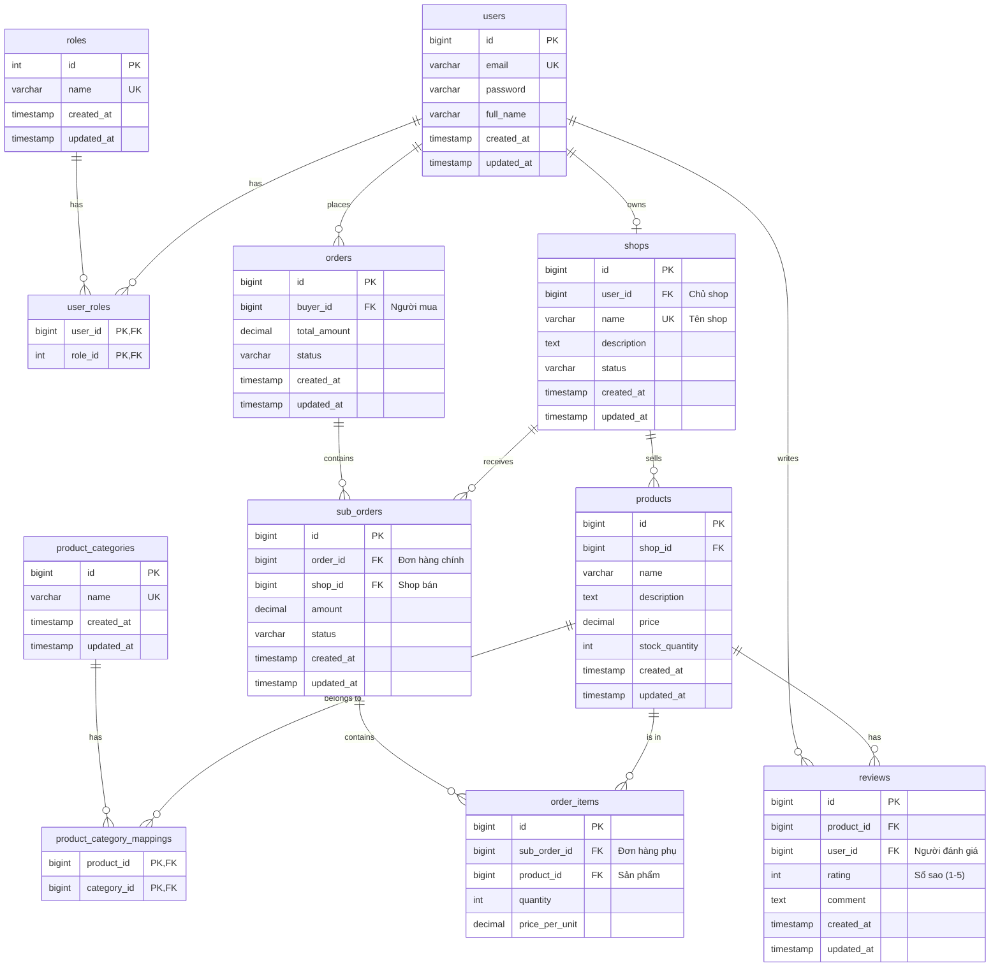

# Thiết kế Lược đồ Cơ sở dữ liệu (Database Schema)

**Phiên bản:** 1.1
**Ngày:** 08-01-2026

---

## 1. Giới thiệu (Introduction)
Tài liệu này định nghĩa cấu trúc cơ sở dữ liệu cho dự án "Sàn Thương Mại Điện Tử". Nó bao gồm sơ đồ quan hệ thực thể (ERD) và đặc tả chi tiết cho từng bảng, đóng vai trò là bản thiết kế cho việc triển khai tầng dữ liệu (data layer) của ứng dụng.

---

## 2. Sơ đồ Quan hệ Thực thể (ERD)

Sơ đồ dưới đây mô tả các thực thể chính và mối quan hệ giữa chúng, đã được cập nhật với các trường `created_at` và `updated_at`.



---

## 3. Đặc tả chi tiết các bảng (Table Specifications)

Tất cả các bảng chính đều có 2 trường `created_at` (thời gian tạo) và `updated_at` (thời gian cập nhật cuối cùng) để phục vụ việc theo dõi, kiểm toán dữ liệu.

#### `users`
| Tên cột | Kiểu dữ liệu | Ràng buộc | Mô tả |
|---|---|---|---|
| id | `bigint` | PK, Auto-increment | ID định danh duy nhất |
| email | `varchar(255)` | UK, NOT NULL | Email đăng nhập, không trùng |
| password | `varchar(255)` | NOT NULL | Mật khẩu đã được mã hóa |
| full_name| `varchar(255)` | NOT NULL | Họ và tên người dùng |
| created_at| `timestamp` | NOT NULL | Thời gian tạo tài khoản |
| updated_at| `timestamp` | NOT NULL | Thời gian cập nhật lần cuối |

#### `roles`
| Tên cột | Kiểu dữ liệu | Ràng buộc | Mô tả |
|---|---|---|---|
| id | `int` | PK, Auto-increment | ID định danh duy nhất |
| name | `varchar(50)`| UK, NOT NULL | Tên vai trò (VD: 'ROLE_BUYER') |
| created_at| `timestamp` | NOT NULL | Thời gian tạo |
| updated_at| `timestamp` | NOT NULL | Thời gian cập nhật lần cuối |

#### `shops`
| Tên cột | Kiểu dữ liệu | Ràng buộc | Mô tả |
|---|---|---|---|
| id | `bigint` | PK, Auto-increment | ID định danh duy nhất |
| user_id | `bigint` | UK, FK (users.id) | ID của chủ shop |
| name | `varchar(255)` | UK, NOT NULL | Tên gian hàng |
| description | `text` | | Mô tả chi tiết về gian hàng |
| status | `varchar(50)` | NOT NULL | Trạng thái (PENDING, ACTIVE, INACTIVE) |
| created_at| `timestamp` | NOT NULL | Thời gian tạo |
| updated_at| `timestamp` | NOT NULL | Thời gian cập nhật lần cuối |

#### `products`
| Tên cột | Kiểu dữ liệu | Ràng buộc | Mô tả |
|---|---|---|---|
| id | `bigint` | PK, Auto-increment | ID định danh duy nhất |
| shop_id | `bigint` | NOT NULL, FK (shops.id) | ID của shop bán sản phẩm |
| name | `varchar(255)`| NOT NULL | Tên sản phẩm |
| description | `text` | | Mô tả chi tiết sản phẩm |
| price | `decimal(10, 2)` | NOT NULL | Giá sản phẩm |
| stock_quantity| `int` | NOT NULL | Số lượng tồn kho |
| created_at| `timestamp` | NOT NULL | Thời gian tạo |
| updated_at| `timestamp` | NOT NULL | Thời gian cập nhật lần cuối |

#### `product_categories`
| Tên cột | Kiểu dữ liệu | Ràng buộc | Mô tả |
|---|---|---|---|
| id | `bigint` | PK, Auto-increment | ID định danh duy nhất |
| name | `varchar(255)`| UK, NOT NULL | Tên danh mục |
| created_at| `timestamp` | NOT NULL | Thời gian tạo |
| updated_at| `timestamp` | NOT NULL | Thời gian cập nhật lần cuối |

#### `orders` (Master Order)
| Tên cột | Kiểu dữ liệu | Ràng buộc | Mô tả |
|---|---|---|---|
| id | `bigint` | PK, Auto-increment | ID định danh duy nhất |
| buyer_id | `bigint` | NOT NULL, FK (users.id)| ID của người mua |
| total_amount| `decimal(12, 2)` | NOT NULL | Tổng giá trị đơn hàng |
| status | `varchar(50)` | NOT NULL | Trạng thái tổng (PENDING_PAYMENT, PAID, CANCELLED) |
| created_at| `timestamp` | NOT NULL | Thời gian tạo đơn |
| updated_at| `timestamp` | NOT NULL | Thời gian cập nhật lần cuối |

#### `sub_orders` (Đơn hàng phụ)
| Tên cột | Kiểu dữ liệu | Ràng buộc | Mô tả |
|---|---|---|---|
| id | `bigint` | PK, Auto-increment | ID định danh duy nhất |
| order_id | `bigint` | NOT NULL, FK (orders.id)| ID của đơn hàng chính |
| shop_id | `bigint` | NOT NULL, FK (shops.id)| ID của shop xử lý |
| amount | `decimal(12, 2)` | NOT NULL | Tổng giá trị của đơn hàng phụ |
| status | `varchar(50)` | NOT NULL | Trạng thái của shop (PENDING, PROCESSING, SHIPPED, DELIVERED, CANCELLED) |
| created_at| `timestamp` | NOT NULL | Thời gian tạo |
| updated_at| `timestamp` | NOT NULL | Thời gian cập nhật lần cuối |

#### `reviews`
| Tên cột | Kiểu dữ liệu | Ràng buộc | Mô tả |
|---|---|---|---|
| id | `bigint` | PK, Auto-increment | ID định danh duy nhất |
| product_id | `bigint` | NOT NULL, FK (products.id) | ID sản phẩm được đánh giá |
| user_id | `bigint` | NOT NULL, FK (users.id) | ID người đánh giá |
| rating | `int` | NOT NULL | Số sao (1-5) |
| comment | `text` | | Nội dung bình luận |
| created_at| `timestamp` | NOT NULL | Thời gian tạo |
| updated_at| `timestamp` | NOT NULL | Thời gian cập nhật lần cuối |

---

## 4. Ghi chú kỹ thuật (Technical Notes)

### Tự động hóa `created_at` và `updated_at`

Để việc quản lý các trường `created_at` và `updated_at` được tự động, lập trình viên nên sử dụng tính năng **JPA Auditing** của Spring Data.

1.  **Kích hoạt JPA Auditing:** Thêm annotation `@EnableJpaAuditing` vào class Application chính.
2.  **Tạo một Base Entity:** Tạo một abstract class (ví dụ: `Auditable`) chứa các trường `createdAt` và `updatedAt`.
    ```java
    @MappedSuperclass
    @EntityListeners(AuditingEntityListener.class)
    public abstract class Auditable<U> {

        @CreatedDate
        @Column(name = "created_at", updatable = false)
        protected Date createdAt;

        @LastModifiedDate
        @Column(name = "updated_at")
        protected Date updatedAt;
    }
    ```
3.  **Kế thừa:** Cho các class Entity chính (User, Product, Shop,...) kế thừa từ class `Auditable` này. Spring Data JPA sẽ tự động điền giá trị cho các trường này mỗi khi một thực thể được tạo hoặc cập nhật.