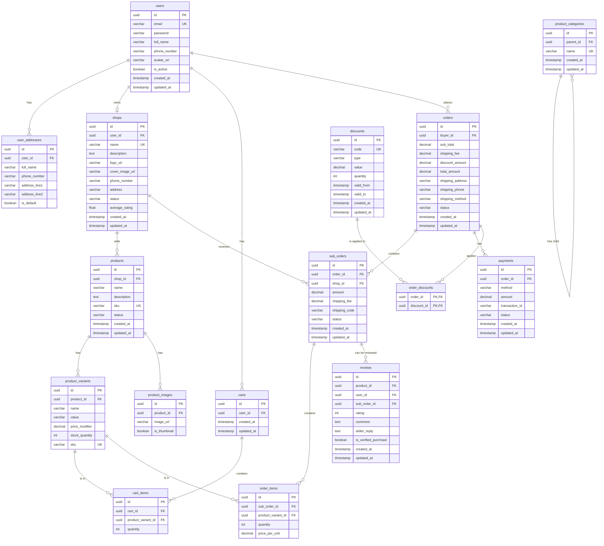

# Thiết kế Lược đồ Cơ sở dữ liệu (Database Schema) - ID dạng UUID

**Phiên bản:** 2.3
**Ngày:** 08-01-2026

---

## 1. Giới thiệu (Introduction)
Tài liệu này định nghĩa cấu trúc cơ sở dữ liệu cho dự án, với **thay đổi chính là tất cả các Primary Key (ID) đều sử dụng kiểu dữ liệu `UUID`** thay cho kiểu số tự tăng. Điều này giúp ID trở nên độc nhất toàn cầu, phù hợp cho các hệ thống phân tán và tăng tính bảo mật.

---

## 2. Sơ đồ Quan hệ Thực thể (ERD) - Phiên bản UUID



---

## 3. Đặc tả chi tiết các bảng (Table Specifications)

*Lưu ý: Bảng đặc tả đã được đơn giản hóa để tập trung vào các thông tin chính.*

#### `users`
| Tên cột | Kiểu dữ liệu | Mô tả | PK/FK |
|---|---|---|---|
| id | `uuid` | ID định danh duy nhất | PK |
| email | `varchar(255)` | Email đăng nhập, không trùng | |
| password | `varchar(255)` | Mật khẩu đã được mã hóa | |
| full_name| `varchar(255)` | Họ và tên người dùng | |
| phone_number| `varchar(20)` | Số điện thoại người dùng | |
| avatar_url| `varchar(255)` | URL ảnh đại diện của người dùng | |
| is_active | `boolean` | Trạng thái tài khoản (true: hoạt động, false: bị khóa/xóa) | |
| created_at| `timestamp` | Thời gian tạo tài khoản | |
| updated_at| `timestamp` | Thời gian cập nhật lần cuối | |

#### `roles`
| Tên cột | Kiểu dữ liệu | Mô tả | PK/FK |
|---|---|---|---|
| id | `int` | ID định danh duy nhất | PK |
| name | `varchar(50)`| Tên vai trò (VD: 'ROLE_BUYER') | |
| created_at| `timestamp` | Thời gian tạo | |
| updated_at| `timestamp` | Thời gian cập nhật lần cuối | |

#### `user_roles`
| Tên cột | Kiểu dữ liệu | Mô tả | PK/FK |
|---|---|---|---|
| user_id | `uuid` | ID của người dùng | PK, FK (users.id) |
| role_id | `int` | ID của vai trò | PK, FK (roles.id) |

#### `user_addresses`
| Tên cột | Kiểu dữ liệu | Mô tả | PK/FK |
|---|---|---|---|
| id | `uuid` | ID định danh | PK |
| user_id | `uuid` | ID của người dùng sở hữu địa chỉ | FK (users.id) |
| full_name| `varchar(255)` | Tên người nhận tại địa chỉ này | |
| phone_number| `varchar(20)` | Số điện thoại người nhận | |
| address_line1 | `varchar(255)` | Địa chỉ chi tiết (số nhà, tên đường, thôn/xóm) | |
| address_line2 | `varchar(255)` | Phường/Xã, Quận/Huyện, Tỉnh/Thành phố | |
| is_default| `boolean` | Đánh dấu là địa chỉ mặc định của người dùng | |
| created_at| `timestamp` | Thời gian tạo | |
| updated_at| `timestamp` | Thời gian cập nhật lần cuối | |

#### `shops`
| Tên cột | Kiểu dữ liệu | Mô tả | PK/FK |
|---|---|---|---|
| id | `uuid` | ID định danh duy nhất | PK |
| user_id | `uuid` | ID của chủ shop (mỗi user chỉ có 1 shop) | FK (users.id) |
| name | `varchar(255)` | Tên gian hàng | |
| description | `text` | Mô tả chi tiết về gian hàng | |
| logo_url | `varchar(255)` | URL logo của shop | |
| cover_image_url| `varchar(255)` | URL ảnh bìa của shop | |
| phone_number | `varchar(20)` | Số điện thoại liên hệ của shop | |
| address | `varchar(255)` | Địa chỉ của shop | |
| status | `varchar(50)` | Trạng thái (PENDING, ACTIVE, INACTIVE, BANNED) | |
| average_rating | `float` | Điểm đánh giá trung bình của shop | |
| created_at| `timestamp` | Thời gian tạo | |
| updated_at| `timestamp` | Thời gian cập nhật lần cuối | |

#### `products`
| Tên cột | Kiểu dữ liệu | Mô tả | PK/FK |
|---|---|---|---|
| id | `uuid` | ID định danh duy nhất | PK |
| shop_id | `uuid` | ID của shop bán sản phẩm | FK (shops.id) |
| name | `varchar(255)`| Tên sản phẩm | |
| description | `text` | Mô tả chi tiết sản phẩm | |
| sku | `varchar(100)` | Stock Keeping Unit - Mã định danh sản phẩm gốc | |
| status | `varchar(50)` | Trạng thái (DRAFT, PUBLISHED, ARCHIVED) | |
| created_at| `timestamp` | Thời gian tạo | |
| updated_at| `timestamp` | Thời gian cập nhật lần cuối | |

#### `product_variants`
| Tên cột | Kiểu dữ liệu | Mô tả | PK/FK |
|---|---|---|---|
| id | `uuid` | ID định danh | PK |
| product_id| `uuid` | ID sản phẩm gốc | FK (products.id) |
| name | `varchar(100)`| Tên thuộc tính (VD: "Màu sắc") | |
| value | `varchar(100)`| Giá trị thuộc tính (VD: "Đỏ") | |
| price_modifier|`decimal(10,2)`| Phần giá chênh lệch so với giá gốc | |
| stock_quantity|`int` | Số lượng tồn kho của phiên bản này | |
| sku | `varchar(100)` | Mã SKU cho phiên bản cụ thể này | |
| created_at| `timestamp` | Thời gian tạo | |
| updated_at| `timestamp` | Thời gian cập nhật lần cuối | |

#### `product_images`
| Tên cột | Kiểu dữ liệu | Mô tả | PK/FK |
|---|---|---|---|
| id | `uuid` | ID định danh | PK |
| product_id| `uuid` | ID sản phẩm | FK (products.id) |
| image_url | `varchar(255)`| URL của ảnh | |
| is_thumbnail| `boolean` | Là ảnh đại diện chính của sản phẩm hay không | |
| created_at| `timestamp` | Thời gian tạo | |
| updated_at| `timestamp` | Thời gian cập nhật lần cuối | |

#### `product_categories`
| Tên cột | Kiểu dữ liệu | Mô tả | PK/FK |
|---|---|---|---|
| id | `uuid` | ID định danh duy nhất | PK |
| parent_id | `uuid` | ID của danh mục cha (NULL nếu là danh mục gốc) | FK (product_categories.id) |
| name | `varchar(255)`| Tên danh mục | |
| created_at| `timestamp` | Thời gian tạo | |
| updated_at| `timestamp` | Thời gian cập nhật lần cuối | |

#### `product_category_mappings`
| Tên cột | Kiểu dữ liệu | Mô tả | PK/FK |
|---|---|---|---|
| product_id | `uuid` | ID của sản phẩm | PK, FK (products.id) |
| category_id | `uuid` | ID của danh mục | PK, FK (product_categories.id) |

#### `carts`
| Tên cột | Kiểu dữ liệu | Mô tả | PK/FK |
|---|---|---|---|
| id | `uuid` | ID giỏ hàng | PK |
| user_id | `uuid` | ID người dùng (mỗi người dùng 1 giỏ hàng) | FK (users.id) |
| created_at| `timestamp` | Thời gian tạo | |
| updated_at| `timestamp` | Thời gian cập nhật lần cuối | |

#### `cart_items`
| Tên cột | Kiểu dữ liệu | Mô tả | PK/FK |
|---|---|---|---|
| id | `uuid` | ID mục trong giỏ hàng | PK |
| cart_id | `uuid` | ID của giỏ hàng | FK (carts.id) |
| product_variant_id| `uuid` | ID phiên bản sản phẩm được thêm vào giỏ | FK (product_variants.id) |
| quantity | `int` | Số lượng sản phẩm | |
| created_at| `timestamp` | Thời gian tạo | |
| updated_at| `timestamp` | Thời gian cập nhật lần cuối | |

#### `orders`
| Tên cột | Kiểu dữ liệu | Mô tả | PK/FK |
|---|---|---|---|
| id | `uuid` | ID định danh duy nhất | PK |
| buyer_id | `uuid` | ID của người mua | FK (users.id) |
| sub_total |`decimal(12,2)`| Tổng tiền hàng (chưa tính phí khác) | |
| shipping_fee|`decimal(10,2)`| Phí vận chuyển | |
| discount_amount|`decimal(12,2)`| Tổng số tiền được giảm giá | |
| total_amount|`decimal(12,2)`| Số tiền cuối cùng khách phải trả | |
| shipping_address|`varchar(255)`| Địa chỉ giao hàng (lưu lại tại thời điểm đặt) | |
| shipping_phone|`varchar(20)`| SĐT người nhận tại địa chỉ giao hàng | |
| shipping_method|`varchar(100)`| Phương thức vận chuyển được chọn | |
| status | `varchar(50)` | Trạng thái tổng của đơn hàng | |
| created_at| `timestamp` | Thời gian tạo đơn | |
| updated_at| `timestamp` | Thời gian cập nhật lần cuối | |

#### `sub_orders`
| Tên cột | Kiểu dữ liệu | Mô tả | PK/FK |
|---|---|---|---|
| id | `uuid` | ID định danh duy nhất | PK |
| order_id | `uuid` | ID của đơn hàng chính | FK (orders.id) |
| shop_id | `uuid` | ID của shop xử lý đơn hàng phụ này | FK (shops.id) |
| amount | `decimal(12,2)`| Tổng giá trị của đơn hàng phụ này | |
| shipping_fee|`decimal(10,2)`| Phí vận chuyển cho riêng shop này | |
| shipping_code|`varchar(100)`| Mã vận đơn của đơn vị vận chuyển | |
| status | `varchar(50)` | Trạng thái của shop (PENDING, PROCESSING, SHIPPED, DELIVERED, CANCELLED) | |
| created_at| `timestamp` | Thời gian tạo | |
| updated_at| `timestamp` | Thời gian cập nhật lần cuối | |

#### `order_items`
| Tên cột | Kiểu dữ liệu | Mô tả | PK/FK |
|---|---|---|---|
| id | `uuid` | ID định danh duy nhất | PK |
| sub_order_id| `uuid` | ID của đơn hàng phụ chứa mục này | FK (sub_orders.id) |
| product_variant_id| `uuid` | ID phiên bản sản phẩm được mua | FK (product_variants.id) |
| quantity | `int` | Số lượng sản phẩm | |
| price_per_unit| `decimal(10,2)`| Giá của 1 sản phẩm tại thời điểm mua | |
| created_at| `timestamp` | Thời gian tạo | |
| updated_at| `timestamp` | Thời gian cập nhật lần cuối | |

#### `payments`
| Tên cột | Kiểu dữ liệu | Mô tả | PK/FK |
|---|---|---|---|
| id | `uuid` | ID giao dịch | PK |
| order_id | `uuid` | ID của đơn hàng liên quan | FK (orders.id) |
| method | `varchar(50)` | Phương thức thanh toán (VD: VNPay, Momo, COD) | |
| amount | `decimal(12,2)`| Số tiền giao dịch | |
| transaction_id| `varchar(255)`| Mã giao dịch từ cổng thanh toán (nếu có) | |
| status | `varchar(50)` | Trạng thái (PENDING, SUCCESS, FAILED, REFUNDED) | |
| created_at| `timestamp` | Thời gian tạo | |
| updated_at| `timestamp` | Thời gian cập nhật lần cuối | |

#### `reviews`
| Tên cột | Kiểu dữ liệu | Mô tả | PK/FK |
|---|---|---|---|
| id | `uuid` | ID định danh | PK |
| product_id | `uuid` | ID sản phẩm được đánh giá | FK (products.id) |
| user_id | `uuid` | ID người dùng đã đánh giá | FK (users.id) |
| sub_order_id | `uuid` | ID đơn hàng phụ chứa sản phẩm được đánh giá | FK (sub_orders.id) |
| rating | `int` | Số sao (1-5) | |
| comment | `text` | Nội dung bình luận | |
| seller_reply | `text` | Phản hồi của người bán về đánh giá | |
| is_verified_purchase| `boolean` | Đánh dấu người đánh giá đã mua sản phẩm này | |
| created_at| `timestamp` | Thời gian tạo | |
| updated_at| `timestamp` | Thời gian cập nhật lần cuối | |

#### `discounts`
| Tên cột | Kiểu dữ liệu | Mô tả | PK/FK |
|---|---|---|---|
| id | `uuid` | ID định danh | PK |
| code | `varchar(50)` | Mã giảm giá (VD: "TET2026") | |
| type | `varchar(50)` | Loại giảm giá (PERCENTAGE, FIXED_AMOUNT) | |
| value | `decimal(12,2)`| Giá trị giảm (VD: 15 cho %, 50000 cho VNĐ) | |
| quantity | `int` | Số lượng mã có thể sử dụng (0 nếu không giới hạn) | |
| valid_from| `timestamp` | Ngày bắt đầu hiệu lực | |
| valid_to | `timestamp` | Ngày hết hiệu lực | |
| created_at| `timestamp` | Thời gian tạo | |
| updated_at| `timestamp` | Thời gian cập nhật lần cuối | |

#### `order_discounts`
| Tên cột | Kiểu dữ liệu | Mô tả | PK/FK |
|---|---|---|---|
| order_id | `uuid` | ID của đơn hàng | PK, FK (orders.id) |
| discount_id | `uuid` | ID của mã giảm giá được áp dụng | PK, FK (discounts.id) |

---

## 4. Ghi chú kỹ thuật

### Sử dụng UUID trong Java/JPA
- Trong các class Entity, khai báo trường `id` với kiểu `java.util.UUID`.
- Sử dụng annotation `@Id` và `@GeneratedValue` để tự động sinh UUID.
  ```java
  import java.util.UUID;
  import jakarta.persistence.Id;
  import jakarta.persistence.GeneratedValue;
  import org.hibernate.annotations.GenericGenerator; // Thường dùng cho UUID

  //...
  
  @Id
  @GeneratedValue(generator = "uuid2")
  @GenericGenerator(name = "uuid2", strategy = "uuid2")
  private UUID id;
  ```
- **Lưu ý về hiệu năng:** Việc sử dụng UUID làm khóa chính có thể ảnh hưởng đến hiệu năng index của CSDL so với kiểu số tự tăng. Tuy nhiên, các CSDL hiện đại như PostgreSQL đã có những tối ưu tốt cho kiểu dữ liệu UUID. Cần cân nhắc kỹ lưỡng và có thể cần các chiến lược index phù hợp khi dữ liệu lớn.
- **JPA Auditing:** Đảm bảo `created_at` và `updated_at` được tự động điền giá trị bằng cách sử dụng `@CreatedDate`, `@LastModifiedDate` và `@EntityListeners(AuditingEntityListener.class)` trong các base entity.